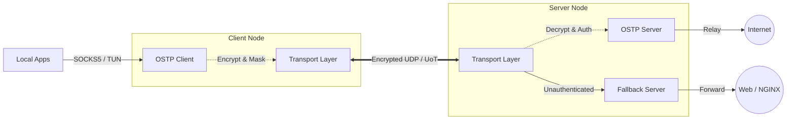

# OSTP — Ospab Stealth Transport Protocol

[Русский язык](README.ru.md) · [Wiki](https://github.com/ospab/ostp/wiki) · [Contributing](CONTRIBUTING.md) · [Releases](https://github.com/ospab/ostp/releases) · [Migration Guide](docs/migration_v0_3_1.md)


OSTP (Ospab Stealth Transport Protocol) is an encrypted transport protocol written in Rust. It implements a custom ARQ transport over UDP and a UDP-over-TCP (UoT) mode. The protocol uses cryptographic masking for all packet headers and payloads to resist traffic classification by Deep Packet Inspection (DPI) systems.

> [!IMPORTANT]
> **Upgrading from v0.2.x?** Please read the [v0.3.1 Configuration Migration Guide](docs/migration_v0_3_1.md).

---

## Technical Capabilities

| Capability | Description |
|------------|-------------|
| **Traffic Masking** | Header and payload encryption using per-packet HMAC-derived keys. Indistinguishable from random noise. |
| **Noise Protocol** | `Noise_NNpsk0_25519_ChaChaPoly_BLAKE2s` — PSK-authenticated, forward-secret key exchange. |
| **Reliable UDP (ARQ)** | Selective ACK/NACK with rate-limited retransmission, configurable reorder buffer, and exponential backoff. |
| **Multiplexed Streams**| Multiple logical TCP streams over a single encrypted UDP session with per-stream flow control. |
| **Session Roaming** | Connection persistence across IP changes via session ID tracking. |
| **UoT Mode** | UDP-over-TCP encapsulation with length-prefixing to bypass UDP blocking. |
| **Fallback Server** | TCP proxying to a legitimate web server to resist active probing. |
| **TUN Mode** | Native network stack integration (`smoltcp`) for full-system routing without external dependencies. |
| **Management API** | Built-in REST API for server administration, metrics, and key generation. |
| **TURN Relay** | RFC 5766 TURN support for NAT traversal. |

---

## Architecture



---

## Quick Start

### 1. Installation

**Linux:**
```bash
bash <(curl -Ls https://raw.githubusercontent.com/ospab/ostp/master/scripts/install.sh)
```

**Windows (PowerShell as Administrator):**
```powershell
irm https://raw.githubusercontent.com/ospab/ostp/master/scripts/install.ps1 | iex
```

### 2. Configuration

Initialize the configuration files for the server and client:
```bash
# On the server:
./ostp --init server

# On the client:
./ostp --init client
```

**Server Example** (`config.json`):
```jsonc
{
  "mode": "server",
  "listen": "0.0.0.0:50000",
  "access_keys": ["YOUR_SECRET_KEY"]
}
```

**Client Example** (`config.json`):
```jsonc
{
  "mode": "client",
  "version": "0.3.1",
  "inbounds": [
    { "type": "local_proxy", "tag": "socks-in", "protocol": "socks", "listen": "127.0.0.1", "port": 1088 }
  ],
  "outbounds": [
    {
      "type": "ostp",
      "tag": "proxy",
      "server": "YOUR_SERVER_IP",
      "port": 50000,
      "access_key": "YOUR_SECRET_KEY",
      "transport": { "type": "udp" }
    }
  ]
}
```

### 3. Execution

```bash
# Run with default config.json
./ostp

# Run with a specific config path
./ostp --config /path/to/config.json
```

Or connect via a one-line share link on the client:
```bash
./ostp "ostp://YOUR_SECRET_KEY@YOUR_SERVER_IP:50000?transport=udp"
```

---

## Protocol Specification

| Layer | Mechanism |
|-------|-----------|
| Key Exchange | Noise NNpsk0 (X25519 + ChaChaPoly + BLAKE2s) zero-RTT |
| Encryption | ChaCha20-Poly1305 AEAD per-packet |
| Header Masking | HMAC-SHA256 derived per-packet mask |
| Reliability | Selective ACK with cumulative + SACK ranges |
| Retransmission | Rate-limited NACK + exponential backoff RTO |
| Keepalive | Ping/Pong with RTT measurement every 5s |

---

## Building from Source

```bash
# Requires Rust 1.75+
cargo build --release

# Cross-compile for Linux
cross build --release --target x86_64-unknown-linux-gnu
```

---

## Documentation

- **[Wiki](https://github.com/ospab/ostp/wiki)**
- [Configuration Reference](https://github.com/ospab/ostp/wiki/Configuration)
- [Management API](https://github.com/ospab/ostp/wiki/Management-API)
- [Protocol Design](https://github.com/ospab/ostp/wiki/Protocol-Design)

---

## License

GNU Affero General Public License v3.0 (AGPL-3.0). See [LICENSE](LICENSE) for more details.

---

## Contacts

- **Telegram**: [@ospab0](https://t.me/ospab0)
- **Email**: gvoprgrg@gmail.com
