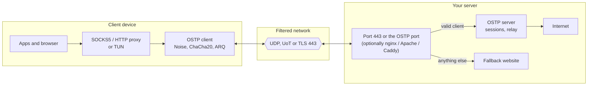

# OSTP - Ospab Stealth Transport Protocol

[Русский](README.ru.md) · [Documentation](docs/README.md) · [Changelog](CHANGELOG.md) · [Releases](https://github.com/ospab/ostp/releases) · [Wiki](https://github.com/ospab/ostp/wiki) · [Contributing](CONTRIBUTING.md)


**OSTP** is an encrypted tunnel written in Rust for networks with active traffic filtering (DPI). A client on your computer or phone sends all
of its traffic, or only the apps and sites you choose, through your own server. The protocol, the server, the command-line tool, the desktop
and Android apps are all in this repository.

What it looks like on the wire depends on the transport you pick:

- **UDP**: every byte, headers included, is indistinguishable from random data; reliability is OSTP's own (selective ACK/NACK, congestion control).
- **UoT** (UDP over TCP): the same packets over a plain TCP connection, for networks that block or throttle unknown UDP.
- **TLS**: UoT inside real TLS with a real certificate on your domain, on port 443, directly or behind nginx, Apache or Caddy on a secret path.
  To anyone else the server is an ordinary website.

---

## Install

**Server or command-line client, Linux:**
```bash
bash <(curl -Ls https://raw.githubusercontent.com/ospab/ostp/master/scripts/install.sh)
```

**Windows (PowerShell as Administrator):**
```powershell
irm https://raw.githubusercontent.com/ospab/ostp/master/scripts/install.ps1 | iex
```

**Apps:** the desktop client (Windows, Linux, macOS) and the Android app (arm64, armv7) are on the [Releases](https://github.com/ospab/ostp/releases) page,
next to prebuilt `ostp` binaries for Windows, Linux (x86, x64, ARM, MIPS, RISC-V), macOS and FreeBSD.

---

## Quick start

**No Linux experience?** Install the desktop app and choose *I have a server* on its first screen (or *Settings → Server management* later).
Enter the VPS address, the SSH login and the password or private key: the app installs OSTP over SSH, adds the connection to itself,
and afterwards manages the server: users, traffic, TLS certificate, subscriptions, updates, logs, and the web panel through the same SSH connection.
The SSH password or key is kept only if you ask, encrypted under a key in the system credential store; the server's host key is pinned on first connect.

**By hand, 1. On the server**, run the setup wizard and print the connection links:

```bash
ostp setup           # server mode, port, access keys
ostp links           # ostp://... links for every user
ostp links qr        # the same as QR codes, one user at a time
```

**2. On the client**, paste a link into the desktop or Android app, or use the command line:

```bash
ostp connect "ostp://ACCESS_KEY@server.example.com:50000?..."   # connect once
ostp import  "ostp://..."                                      # save it to the config
```

Keep the link in quotes, or the shell will cut it at `&` or `?`.

**3. Optional, on a server with a domain:**

```bash
ostp cert issue --domain vpn.example.com   # HTTPS and a Let's Encrypt certificate, TLS transport on 443
ostp sub enable                            # per-user subscription links the apps can refresh
ostp panel enable                          # web panel and management API
ostp dns enable                            # filtering DNS for connected clients
```

Details: [Domains and TLS](docs/en/tls.md), [Server](docs/en/server.md), [Client](docs/en/client.md).

---

## Features

| | |
|---|---|
| **Three transports** | UDP, UoT (UDP over TCP) and TLS on 443 with a real certificate, directly or behind a web server on a secret path. |
| **No fingerprint of its own** | Headers are masked per packet, handshake sizes vary per key, junk packets and TCP fragmentation are available; nothing on the wire is constant. |
| **Probe resistance** | Anything that is not a valid client gets the fallback website or a decoy answer. |
| **Seamless roaming** | On a network change or a stalled path the session moves to a new socket without a new handshake; open connections stay up. |
| **Proxy and TUN** | A local SOCKS5/HTTP proxy (and the Windows system proxy), or a full-system VPN through a TUN adapter with a kill switch. |
| **Split tunneling** | Exclude domains, IP ranges and, on Windows, processes from the tunnel. |
| **Subscriptions** | Per-user subscription URLs with a page for browsers; the apps import and refresh them. |
| **Web panel and API** | Users, keys, traffic limits, statistics, DNS settings; a REST API for your own tools. |
| **Filtering DNS** | Block lists, custom rules, local names and safe search for connected clients. |
| **Network prober** | Tries every transport against your server and locates filtering equipment by TTL. |
| **Outbound routing** | Send the server's outgoing traffic through a SOCKS5 proxy by rule, or from a chosen source address. |

The protocol itself, `Noise_NNpsk0_25519_ChaChaPoly_BLAKE2s` with ChaCha20-Poly1305 per packet and HMAC-derived header masks, is described in the
[specification](docs/en/specification.md).

---

## How it works


```mermaid
flowchart LR
    subgraph Client["Client device"]
        Apps["Apps and browser"] --> In["SOCKS5 / HTTP proxy<br/>or TUN"]
        In --> CEngine["OSTP client<br/>Noise, ChaCha20, ARQ"]
    end

    subgraph Net["Filtered network"]
        Wire{{"UDP, UoT or TLS 443"}}
    end

    subgraph Server["Your server"]
        Front["Port 443 or the OSTP port<br/>(optionally nginx / Apache / Caddy)"]
        SEngine["OSTP server<br/>sessions, relay"]
        Site["Fallback website"]
        Out["Internet"]
        Front -->|valid client| SEngine
        Front -->|anything else| Site
        SEngine --> Out
    end

    CEngine <--> Wire <--> Front
```

---

## Commands

```
ostp [--config PATH] [COMMAND]
```

| Command | What it does |
|---|---|
| *(none)* | Run as client or server, as the config says |
| `setup` | Interactive setup wizard |
| `init server\|client\|relay` | Write a template config |
| `check` | Validate the config and print a summary |
| `connect <URL>` | Connect once with an `ostp://` link |
| `import <URL>` | Save an `ostp://` link or a subscription URL to the config |
| `links [qr]` | Print the users' `ostp://` links, or show them as QR codes |
| `gk` | Generate an access key (`--format hex\|base64`, `-n` count) |
| `cert issue\|status\|renew` | Domain, HTTPS and the Let's Encrypt certificate (server) |
| `sub status\|enable\|disable\|set\|urls` | Subscription links (server) |
| `panel status\|enable\|disable\|set\|passwd\|token` | Web panel and management API (server) |
| `dns status\|enable\|disable\|...` | Filtering DNS for clients (server) |
| `hash-password` | Hash a password for the panel config |
| `migrate [--dry-run]` | Upgrade the config to the current format; never done automatically |
| `update [-b stable\|beta\|alpha] [-v VERSION]` | Install another release |
| `changelog`, `cl` | What changed in this version (`--all`, `--last N`, `--version X`, `--lang en\|ru`) |
| `proxy-env`, `proxy-env-clear` | Shell exports for the local proxy |
| `uninstall` | Stop the service, remove the binary and the config |

The config is `/etc/ostp/config.json` on Linux and `config.json` in the current folder on Windows; `--config` picks another file. Every command has `--help`.

---

## Documentation

The index is [docs/README.md](docs/README.md). Most used:

- [Client](docs/en/client.md) and [Server](docs/en/server.md)
- [Domains and TLS](docs/en/tls.md)
- [Protocol specification](docs/en/specification.md), [Obfuscation](docs/en/obfuscation.md), [Architecture](docs/en/architecture.md)
- [Integrations and the management API](docs/en/integrations.md)
- [Test protocol](docs/en/testing.md) run before each release
- [Changelog](CHANGELOG.md)

---

## Building from source

```bash
cargo build --release     # the ostp binary: target/release/ostp
cargo test --workspace
```

Needs a current stable Rust. The desktop and Android apps have their own steps: [ostp-gui](ostp-gui/README.md), [ostp-flutter](ostp-flutter/README.md).
How the repository is organized and how to send changes: [CONTRIBUTING.md](CONTRIBUTING.md).

---

## Security

Found a vulnerability? Please report it privately, not in a public issue: see [SECURITY.md](SECURITY.md).

## License

GNU Affero General Public License v3.0 (AGPL-3.0), see [LICENSE](LICENSE).

## Contact

- Telegram: [@ospab0](https://t.me/ospab0)
- Email: gvoprgrg@gmail.com
