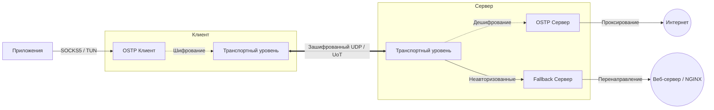

# OSTP — Ospab Stealth Transport Protocol

[English](README.md) · [Wiki](https://github.com/ospab/ostp/wiki) · [Contributing](CONTRIBUTING.ru.md) · [Миграция v0.3.1](docs/migration_v0_3_1_ru.md)


OSTP (Ospab Stealth Transport Protocol) — зашифрованный транспортный протокол, написанный на Rust. Реализует механизм ARQ поверх UDP, а также режим UoT (UDP-over-TCP). Протокол использует криптографическое маскирование заголовков и полезной нагрузки для защиты от систем глубокого анализа трафика (DPI).

> [!IMPORTANT]
> **Обновляетесь с версии v0.2.x?** Пожалуйста, ознакомьтесь с [Руководством по миграции конфигурации v0.3.1](docs/migration_v0_3_1_ru.md).

---

## Технические характеристики

| Возможность | Описание |
|-------------|----------|
| **Маскирование трафика** | Шифрование заголовков и полезной нагрузки с помощью HMAC ключей на каждый пакет. Трафик неотличим от шума. |
| **Noise Protocol** | `Noise_NNpsk0_25519_ChaChaPoly_BLAKE2s` — аутентификация через PSK, forward secrecy. |
| **Reliable UDP (ARQ)** | Selective ACK/NACK с rate-limited ретрансмиссией, настраиваемым reorder-буфером и exponential backoff. |
| **Мультиплексирование** | Несколько логических TCP-потоков поверх одной зашифрованной UDP-сессии с per-stream flow control. |
| **Session Roaming** | Сохранение соединения при смене IP-адреса благодаря отслеживанию по идентификатору сессии (session ID). |
| **Режим UoT** | Инкапсуляция UDP внутри TCP с указанием длины пакетов для обхода блокировок неизвестного UDP-трафика. |
| **Fallback Server** | Проксирование неаутентифицированных TCP подключений на веб-сервер для защиты от активного пробинга. |
| **TUN-режим** | Полносистемная маршрутизация через встроенный сетевой стек `smoltcp` без внешних зависимостей. |
| **Management API** | Встроенный REST API для администрирования сервера, сбора метрик и генерации ключей. |
| **TURN Relay** | Поддержка RFC 5766 TURN для обхода NAT. |

---

## Архитектура



---

## Быстрый старт

### 1. Установка

**Linux:**
```bash
bash <(curl -Ls https://raw.githubusercontent.com/ospab/ostp/master/scripts/install.sh)
```

**Windows (PowerShell от Администратора):**
```powershell
irm https://raw.githubusercontent.com/ospab/ostp/master/scripts/install.ps1 | iex
```

### 2. Конфигурация

Сгенерируйте базовые файлы конфигурации:
```bash
# На сервере:
./ostp --init server

# На клиенте:
./ostp --init client
```

**Пример конфигурации сервера** (`config.json`):
```jsonc
{
  "mode": "server",
  "listen": "0.0.0.0:50000",
  "access_keys": ["ВАШ_КЛЮЧ"]
}
```

**Пример конфигурации клиента** (`config.json`):
```jsonc
{
  "mode": "client",
  "version": "0.3.1",
  "inbounds": [
    { "type": "local_proxy", "tag": "socks-in", "protocol": "socks", "listen": "127.0.0.1", "port": 1088 }
  ],
  "outbounds": [
    {
      "type": "ostp",
      "tag": "proxy",
      "server": "IP_СЕРВЕРА",
      "port": 50000,
      "access_key": "ВАШ_КЛЮЧ",
      "transport": { "type": "udp" }
    }
  ]
}
```

### 3. Запуск

```bash
# Запуск с конфигурацией по умолчанию (config.json)
./ostp

# Запуск с указанием пути к конфигурации
./ostp --config /path/to/config.json
```

Либо подключение через однострочную ссылку на стороне клиента:
```bash
./ostp "ostp://ВАШ_КЛЮЧ@IP_СЕРВЕРА:50000?transport=udp"
```

---

## Спецификация протокола

| Уровень | Механизм |
|---------|----------|
| Обмен ключами | Noise NNpsk0 (X25519 + ChaChaPoly + BLAKE2s) zero-RTT |
| Шифрование | ChaCha20-Poly1305 AEAD на каждый пакет |
| Обфускация заголовков | HMAC-SHA256 маска на основе session_id и nonce |
| Надёжность | Selective ACK с cumulative + SACK диапазонами |
| Ретрансмиссия | Rate-limited NACK + exponential backoff RTO |
| Keepalive | Ping/Pong с измерением RTT каждые 5с |

---

## Сборка из исходников

```bash
# Требования: Rust 1.75+
cargo build --release

# Кросс-компиляция для Linux
cross build --release --target x86_64-unknown-linux-gnu
```

---

## Документация

- **[Wiki](https://github.com/ospab/ostp/wiki)**
- [Спецификация протокола](docs/ru/specification.md)
- [Дизайн обфускации](docs/ru/obfuscation.md)
- [Архитектура](docs/ru/architecture.md)
- [Настройка клиента](docs/ru/client.md)

---

## Лицензия

GNU Affero General Public License v3.0 (AGPL-3.0). Подробнее см. в файле [LICENSE](LICENSE).

---

## Контакты

- **Telegram**: [@ospab0](https://t.me/ospab0)
- **Email**: gvoprgrg@gmail.com
