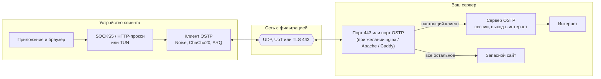

# OSTP - Ospab Stealth Transport Protocol

[English](README.md) · [Документация](docs/README.md) · [Журнал изменений](CHANGELOG.ru.md) · [Releases](https://github.com/ospab/ostp/releases) · [Wiki](https://github.com/ospab/ostp/wiki) · [Участие в разработке](CONTRIBUTING.ru.md)


**OSTP** — зашифрованный туннель на Rust для сетей с активной фильтрацией трафика (DPI). Клиент на компьютере или телефоне отправляет весь
трафик, или только выбранные приложения и сайты, через ваш собственный сервер. Протокол, сервер, утилита командной строки, десктопное
и Android-приложения — всё в этом репозитории.

Как это выглядит на проводе, зависит от выбранного транспорта:

- **UDP**: каждый байт, включая заголовки, неотличим от случайных данных; надёжность своя (выборочные ACK/NACK, контроль перегрузки).
- **UoT** (UDP поверх TCP): те же пакеты внутри обычного TCP-соединения — для сетей, где незнакомый UDP блокируют или режут.
- **TLS**: UoT внутри настоящего TLS с настоящим сертификатом на вашем домене, на порту 443, напрямую или за nginx, Apache или Caddy по
  секретному пути. Для всех остальных сервер выглядит обычным сайтом.

---

## Установка

**Сервер или клиент командной строки, Linux:**
```bash
bash <(curl -Ls https://raw.githubusercontent.com/ospab/ostp/master/scripts/install.sh)
```

**Windows (PowerShell от имени администратора):**
```powershell
irm https://raw.githubusercontent.com/ospab/ostp/master/scripts/install.ps1 | iex
```

**Приложения:** десктопный клиент (Windows, Linux, macOS) и Android-приложение (arm64, armv7) — на странице [Releases](https://github.com/ospab/ostp/releases),
там же готовые бинарники `ostp` для Windows, Linux (x86, x64, ARM, MIPS, RISC-V), macOS и FreeBSD.

---

## Быстрый старт

**1. На сервере** запустите мастер настройки и выведите ссылки для подключения:

```bash
ostp setup           # режим сервера, порт, ключи доступа
ostp links           # ссылки ostp://... для каждого пользователя
ostp links qr        # то же QR-кодами, по одному пользователю
```

**2. На клиенте** вставьте ссылку в десктопное или Android-приложение либо используйте командную строку:

```bash
ostp connect "ostp://ACCESS_KEY@server.example.com:50000?..."   # подключиться один раз
ostp import  "ostp://..."                                      # сохранить в конфиг
```

Ссылку берите в кавычки, иначе оболочка обрежет её на `&` или `?`.

**3. По желанию, на сервере с доменом:**

```bash
ostp cert issue --domain vpn.example.com   # HTTPS и сертификат Let's Encrypt, транспорт TLS на 443
ostp sub enable                            # персональные ссылки подписки, приложения обновляют их сами
ostp panel enable                          # веб-панель и API управления
ostp dns enable                            # фильтрующий DNS для подключённых клиентов
```

Подробнее: [Домены и TLS](docs/ru/tls.md), [Сервер](docs/ru/server.md), [Клиент](docs/ru/client.md).

---

## Возможности

| | |
|---|---|
| **Три транспорта** | UDP, UoT (UDP поверх TCP) и TLS на 443 с настоящим сертификатом, напрямую или за веб-сервером по секретному пути. |
| **Без собственного отпечатка** | Заголовки маскируются для каждого пакета, размер хэндшейка зависит от ключа, есть мусорные пакеты и фрагментация TCP; постоянного на проводе нет ничего. |
| **Защита от прощупывания** | Всё, что не является настоящим клиентом, получает запасной сайт или ответ-приманку. |
| **Бесшовный роуминг** | При смене сети или зависшем пути сессия переносится на новый сокет без нового хэндшейка; открытые соединения не рвутся. |
| **Прокси и TUN** | Локальный SOCKS5/HTTP-прокси (и системный прокси Windows) или VPN для всей системы через TUN-адаптер с kill switch. |
| **Раздельное туннелирование** | Домены, диапазоны IP и, на Windows, процессы можно пустить мимо туннеля. |
| **Подписки** | Персональные ссылки подписки со страницей для браузера; приложения импортируют и обновляют их. |
| **Веб-панель и API** | Пользователи, ключи, лимиты трафика, статистика, настройки DNS; REST API для своих инструментов. |
| **Фильтрующий DNS** | Списки блокировки, свои правила, локальные имена и безопасный поиск для подключённых клиентов. |
| **Пробер сети** | Пробует все транспорты до вашего сервера и находит оборудование фильтрации по TTL. |
| **Маршрутизация исходящего трафика** | Исходящий трафик сервера — через SOCKS5-прокси по правилам или с выбранного исходного адреса. |

Сам протокол — `Noise_NNpsk0_25519_ChaChaPoly_BLAKE2s`, ChaCha20-Poly1305 для каждого пакета и маски заголовков на HMAC — описан в
[спецификации](docs/ru/specification.md).

---

## Как это устроено


```mermaid
flowchart LR
    subgraph Client["Устройство клиента"]
        Apps["Приложения и браузер"] --> In["SOCKS5 / HTTP-прокси<br/>или TUN"]
        In --> CEngine["Клиент OSTP<br/>Noise, ChaCha20, ARQ"]
    end

    subgraph Net["Сеть с фильтрацией"]
        Wire{{"UDP, UoT или TLS 443"}}
    end

    subgraph Server["Ваш сервер"]
        Front["Порт 443 или порт OSTP<br/>(при желании nginx / Apache / Caddy)"]
        SEngine["Сервер OSTP<br/>сессии, выход в интернет"]
        Site["Запасной сайт"]
        Out["Интернет"]
        Front -->|настоящий клиент| SEngine
        Front -->|всё остальное| Site
        SEngine --> Out
    end

    CEngine <--> Wire <--> Front
```

---

## Команды

```
ostp [--config ПУТЬ] [КОМАНДА]
```

| Команда | Что делает |
|---|---|
| *(без команды)* | Запуск клиентом или сервером, как указано в конфиге |
| `setup` | Мастер настройки |
| `init server\|client\|relay` | Записать шаблон конфига |
| `check` | Проверить конфиг и вывести сводку |
| `connect <URL>` | Подключиться один раз по ссылке `ostp://` |
| `import <URL>` | Сохранить в конфиг ссылку `ostp://` или ссылку подписки |
| `links [qr]` | Вывести ссылки `ostp://` пользователей или показать их QR-кодами |
| `gk` | Создать ключ доступа (`--format hex\|base64`, `-n` количество) |
| `cert issue\|status\|renew` | Домен, HTTPS и сертификат Let's Encrypt (сервер) |
| `sub status\|enable\|disable\|set\|urls` | Ссылки подписки (сервер) |
| `panel status\|enable\|disable\|set\|passwd\|token` | Веб-панель и API управления (сервер) |
| `dns status\|enable\|disable\|...` | Фильтрующий DNS для клиентов (сервер) |
| `hash-password` | Хэш пароля для конфига панели |
| `migrate [--dry-run]` | Обновить конфиг до текущего формата; сама программа этого никогда не делает |
| `update [-b stable\|beta\|alpha] [-v ВЕРСИЯ]` | Установить другой выпуск |
| `changelog`, `cl` | Что изменилось в этой версии (`--all`, `--last N`, `--version X`, `--lang en\|ru`) |
| `proxy-env`, `proxy-env-clear` | Команды export для локального прокси |
| `uninstall` | Остановить службу, удалить бинарник и конфиг |

Конфиг — `/etc/ostp/config.json` на Linux и `config.json` в текущей папке на Windows; другой файл задаётся через `--config`. У каждой
команды есть `--help`.

---

## Документация

Оглавление — [docs/README.md](docs/README.md). Чаще всего нужны:

- [Клиент](docs/ru/client.md) и [Сервер](docs/ru/server.md)
- [Домены и TLS](docs/ru/tls.md)
- [Спецификация протокола](docs/ru/specification.md), [Обфускация](docs/ru/obfuscation.md), [Архитектура](docs/ru/architecture.md)
- [Интеграции и API управления](docs/ru/integrations.md)
- [Протокол тестирования](docs/ru/testing.md) перед каждым выпуском
- [Журнал изменений](CHANGELOG.ru.md)

---

## Сборка из исходников

```bash
cargo build --release     # бинарник ostp: target/release/ostp
cargo test --workspace
```

Нужна актуальная стабильная версия Rust. У десктопного и Android-приложений свои шаги: [ostp-gui](ostp-gui/README.md), [ostp-flutter](ostp-flutter/README.md).
Как устроен репозиторий и как присылать изменения: [CONTRIBUTING.ru.md](CONTRIBUTING.ru.md).

---

## Безопасность

Нашли уязвимость? Сообщите о ней закрыто, а не в публичном issue: см. [SECURITY.ru.md](SECURITY.ru.md).

## Лицензия

GNU Affero General Public License v3.0 (AGPL-3.0), см. [LICENSE](LICENSE).

## Контакты

- Telegram: [@ospab0](https://t.me/ospab0)
- Email: gvoprgrg@gmail.com
